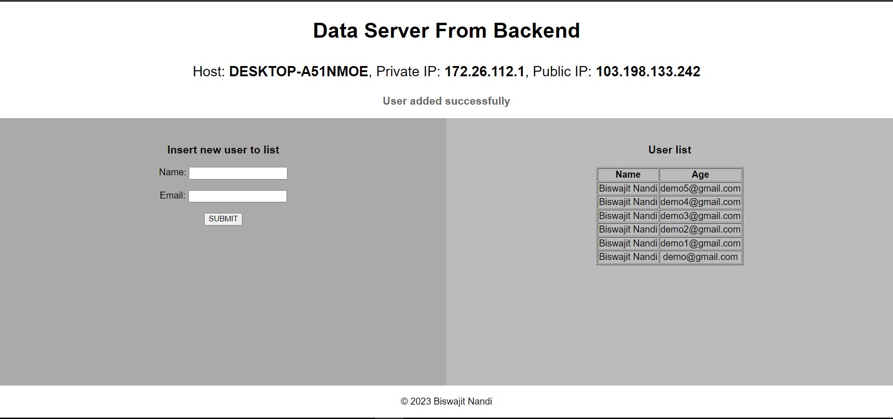

# nodejs-demo-app
This is a node demo application using the express js server and MongoDB. we can insert data to the MongoDB database and fetch data and show on the frontend page, also it shows the hostname, private IP, and public IP.



Install packages
```
npm install
```
Start server
```
npm start
````
URL Browser

```
http://localhost:5000/
```
